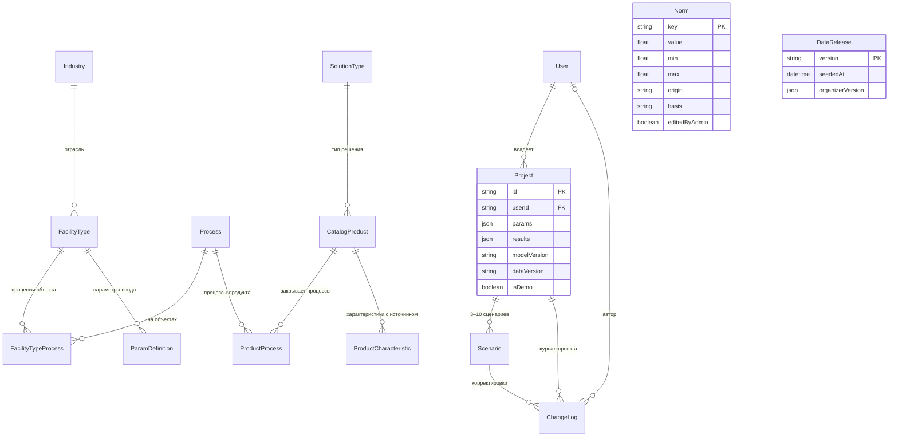
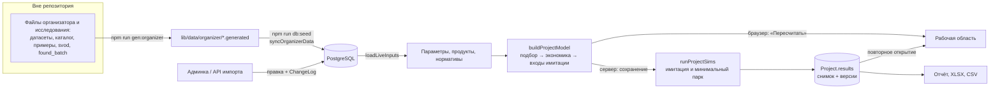

# Архитектура платформы

> Документ для ТЗ §6.1, §6.3, §6.4 и §6.8: аудитория и границы, компоненты, модель данных,
> потоки данных, алгоритм подбора, API, безопасность, производительность, библиотеки.
> Экономическая модель и имитация — в [MODEL-TZ.md](./MODEL-TZ.md), статус функций — в
> [LIMITATIONS.md](./LIMITATIONS.md), развёртывание — в
> [DEPLOY-QUICKSTART.md](./DEPLOY-QUICKSTART.md).

## 1. Аудитория, сценарии и границы решения (ТЗ §6.1)

**Для кого.** Руководитель склада или распределительного центра, финансовый директор и
инженер по внедрению, которые решают, роботизировать ли процесс и каким решением. Второй
пользователь — администратор платформы (например, аналитик ФЦ БАС), который ведёт каталог,
нормативы и параметры по умолчанию.

**Сценарии** (ТЗ §2.1):
1. Гость открывает каталог и демонстрационный расчёт на данных организатора без входа.
2. Пользователь создаёт проект, вводит параметры своего объекта или загружает файл,
   получает подбор решений и сравнивает их.
3. Пользователь сравнивает «Как есть», покупку и услугу (RaaS): CAPEX, OPEX, эффект,
   окупаемость, ROI, NPV, TCO, риски.
4. Пользователь запускает имитацию и проверяет, достижим ли рассчитанный поток.
5. Пользователь сохраняет проект и выгружает отчёт (PDF через печать), Excel, CSV и PNG.
6. Администратор актуализирует каталог, нормативы и параметры по умолчанию; каждое его
   действие пишется в журнал.

**Границы.** Полная модель — перемещение паллет на складе. Аэропорт и медучреждение — на
уровне выбора, параметров и доступных решений (ТЗ §5.5). Полный перечень того, что сделано
частично или прототипом, — [LIMITATIONS.md](./LIMITATIONS.md).

## 2. Стек

| Слой | Технология | Почему |
|---|---|---|
| Веб-приложение | Next.js 16.3 (App Router), React 19.2, TypeScript 5.9 | один язык для сервера и браузера: движок расчёта и имитация работают в обоих без копий кода |
| Интерфейс | Tailwind CSS 4, компоненты shadcn на Base UI, lucide-react | русский интерфейс без внешних скриптов, совместимый со строгим CSP |
| База данных | PostgreSQL 16, Prisma 7 с драйвер-адаптером `@prisma/adapter-pg` | реляционная модель каталога и проектов (ТЗ §4.2.4); миграции в репозитории |
| Вход | Auth.js v5 (credentials), пароли bcrypt | роли гость, пользователь, администратор (ТЗ §3.1.1) |
| Выгрузки | exceljs (XLSX на сервере), собственный CSV без зависимостей | живые формулы в Excel, CSV для русского Excel |
| Тесты | Vitest 4 (наборы `unit` и `db`), Playwright (Chromium) | модель, данные и путь пользователя |
| Запуск | Docker (многостадийный `Dockerfile`), `docker-compose.yml` | запуск одной командой (ТЗ §4.2.3) |

Все библиотеки — свободное ПО с открытым исходным кодом (ТЗ §4.2.2). Полный перечень с
версиями и ссылками — §10.

## 3. Компоненты

Приложение — одно Next.js-приложение с серверной и клиентской частью (ТЗ §4.2.1). Страницы —
серверные компоненты, мутации — серверные действия и обработчики API. Расчёт — чистые функции
TypeScript, которые вызывает и сервер, и браузер.

### 3.1 Два слоя: новая модель и замороженная v1

Проект начинался с краткого брифа из четырёх шагов ([00-idea-brief.md](./00-idea-brief.md)) и
первой модели v1: 47 типов объектов, расчёт в долларах, мастер `/onboarding → /compare →
/calculate → /report`. Официальное ТЗ ФЦ БАС шире: рубли, нормативы организатора, проекты со
сценариями, подбор с причинами, имитация, админка, API.

Новая модель `tz-1.0.0` построена **рядом**, а не поверх v1:
- у v1 в 58 файлах 484 упоминания долларов и около 25 тестов, закрепляющих числа; перевод на
  месте менял бы все числа сразу, без запасного пути;
- v1 продолжает работать на своих таблицах (`Solution`, `Assumption`, `SavedAnalysis`), её
  тесты не менялись;
- миграция `20260924120000_tz_v2` только добавляет таблицы и колонку `User.role`.

Инвариант проверяется на каждом шлюзе: `git diff` по путям v1 (`lib/economics`,
`components/calculator`, `components/facility-visualization.tsx`, `app/(wizard)`,
`app/(app)/report`, `app/(app)/analyses`, `lib/wizard`, `lib/analyses`, `lib/scene`,
`lib/sources`, `lib/db/queries.ts` и четыре e2e v1) должен быть пуст. Из v1 новая модель только
импортирует `npv` и `discountedPaybackYears` (`lib/economics/finance.ts`) и `generateLayout`
(`lib/scene/layout.ts`) для статичной схемы аэропорта и больницы. v1 убрана с пути жюри и
доступна со страницы «Проекты» и из нижней секции лендинга.

### 3.2 Модули новой модели

| Модуль | Назначение | Зависит от |
|---|---|---|
| `lib/tz/types.ts`, `version.ts`, `norms.ts`, `processes.ts`, `characteristics.ts` | Контракты: словарь типов, версии и хэш данных, нормативы, процессы и типы решений, 31 обязательная характеристика ТЗ §3.3.4 | — |
| `lib/data/organizer/*` | Данные организатора и исследования: `params.generated.ts`, `catalog.generated.json`, `version.generated.ts` (генерирует `scripts/gen-organizer-seed.ts`), ручные решения `decisions.ts` | контракты |
| `lib/tz/params` | Параметры объекта: значения по умолчанию, приведение типов, проверка, разбор Excel/CSV, шаблоны | контракты, `lib/files/csv.ts` |
| `lib/tz/selection` | Подбор решений (§6 ниже) | контракты, `lib/tz/econ/fleet.ts` |
| `lib/tz/econ` | Движок экономики ([MODEL-TZ.md](./MODEL-TZ.md)) | контракты, `lib/economics/finance.ts` |
| `lib/sim` | Имитация склада: планировка, маршруты, аналитика цикла, движок, метрики, перебор парка | контракты |
| `lib/tz/model.ts` | Сборка модели проекта из всего перечисленного | всё выше |
| `lib/catalog/*` | Доступ к каталогу (`queries.ts`), снимок продукта для расчёта, вынесенные колонки, синхронизация данных организатора (`sync.ts`) | Prisma |
| `lib/projects/*` | Проекты: сценарии по умолчанию, проверка ввода, журнал, пересчёт на сервере, запросы, серверные действия, действие загрузки файла | Prisma, модель |
| `lib/report/tz/*` | Строки отчёта, CSV, книга XLSX из 13 листов | модель |
| `lib/admin/actions.ts` | Серверные действия администратора | Prisma, каталог |
| `lib/api/*` | API v1: доступ, разбор тела, описание OpenAPI, импорт каталога, нормативы | каталог, проекты |
| `lib/auth/guards.ts` | `requireUser`, `requireAdmin`, `getAdminUser`, `isAdminSession` — роль перечитывается из базы | Auth.js, Prisma |
| `components/project/*` | Рабочая область проекта: шаги, параметры, подбор, сравнение, сценарии, статьи, трассировка, чувствительность, вывод, журнал, нормативы, отчётная панель | модель |
| `components/sim/*` | Интерфейс имитации: канва, управление, показатели, легенда, PNG | `lib/sim` |
| `components/catalog/*`, `components/admin/*`, `components/report/tz/*` | Каталог, админка, печатный отчёт и выгрузки | каталог, отчёт |

### 3.3 Маршруты

По сборке CI на коммите `b112b35` в приложении 43 маршрута (страницы и обработчики), все
серверные (`ƒ`), плюс служебный `/_not-found`. Маршруты новой модели:

| Маршрут | Доступ | Назначение |
|---|---|---|
| `/` | все | лендинг: «Открыть демо-расчёт склада», «Создать проект»; внизу — вход в v1 |
| `/demo`, `/demo?facility=airport\|medical` | все | гостевой расчёт на данных организатора без сохранения (ТЗ §3.1.2, §5.5) |
| `/projects`, `/projects/new`, `/projects/[projectId]` | пользователь | список, создание, рабочая область из 8 шагов |
| `/projects/[projectId]/report`, `/export.xlsx`, `/export.csv` | владелец проекта | отчёт для печати в PDF, выгрузки |
| `/catalog`, `/catalog/[slug]`, `/catalog/compare` | все | каталог, карточка с провенансом, сравнение |
| `/admin`, `/admin/catalog`, `/admin/catalog/[slug]`, `/admin/norms`, `/admin/params`, `/admin/data` | администратор | админка |
| `/methodology/tz` | все | формулы, нормативы, процессы, имитация, версии, ограничения |
| `/api/v1/*`, `/api/v1/openapi.json`, `/api-docs` | по методу | API и его описание |
| `/api/health`, `/api/templates/[facility]` | все | проверка здоровья, шаблоны параметров |

## 4. Модель данных

Таблицы новой модели (миграция `20260924120000_tz_v2`) и их связь с таблицами v1
`Industry`, `FacilityType` и `User`:

| Таблица | Что хранит | Требование ТЗ |
|---|---|---|
| `Process`, `FacilityTypeProcess`, `SolutionType` | звено «процесс» и «тип решения» иерархии; модель спроса, единицы, признаки «экономика и имитация реализованы» | §3.3.1 |
| `CatalogProduct` | продукт каталога; вынесенные колонки (цена, ставка RaaS, производительность, полнота, доля подтверждённых) для фильтров; признаки исключения, архива, правки администратора | §3.3 |
| `ProductCharacteristic` | каждая характеристика со значением, единицей, областью («на робота»), происхождением, ссылкой, датой, подтверждением, цитатой «как в источнике» и альтернативами | §3.3.4 |
| `ParamDefinition` | описание параметра объекта: подпись, единица, вид, значение по умолчанию, диапазон, обязательность, подсказка, пример, источник | §3.1.4, §3.2.4–§3.2.6 |
| `Norm` | норматив расчёта с диапазоном и основанием | §3.1.4, §3.5.1 |
| `DataRelease` | выпуск данных организатора: версия и состав выгрузок | §3.1.5 |
| `Project`, `Scenario` | проект пользователя, сценарии, снимок расчёта с версиями модели и данных | §3.1.3, §3.1.5 |
| `ChangeLog` | единый журнал: корректировки сценариев и действия администратора | §3.5.4, §3.3.5 |

Ключевые решения:
- **Провенанс по полю, а не по продукту.** Ссылка, дата и подтверждение живут в каждой
  строке `ProductCharacteristic`; вынесенные колонки `CatalogProduct` пересчитываются из
  характеристик функцией `promoteColumns`, руками их не правят.
- **Снимок расчёта в проекте.** `Project.results` хранит входы, результаты, снимки продуктов
  сценариев, использованные нормативы и сводки имитации. Повторное открытие воспроизводит
  расчёт из снимка бит-в-бит; если живые данные или модель изменились, показывается баннер
  «Пересчитать на актуальных данных».
- **Журнал — таблица, а не массив в проекте.** Две одновременные записи не теряют друг друга.
- **Каскад.** Удаление проекта удаляет сценарии и журнал проекта. Загруженные файлы не
  хранятся, поэтому удалять больше нечего (ТЗ §4.4.6).
- **Архив вместо удаления.** Продукт организатора, пропавший из данных, уходит в архив: на
  его снимок может ссылаться сохранённый проект.

## 5. Потоки данных

1. **Данные организатора.** Генератор читает JSON-выгрузки из папки вне репозитория
   (`ORGANIZER_DATA_DIR`) и пишет модули в `lib/data/organizer/`. Оригиналы организатора в
   репозиторий не попадают. Подробности и правила выбора значений —
   [data-provenance.md](./data-provenance.md).
2. **Сев.** `npm run db:seed` засевает справочники v1 и вызывает `seedV2`: синхронизация
   (`syncOrganizerData`: типы решений, процессы, связи, параметры, нормативы, продукты,
   выпуск данных), демо-аккаунты и демо-проект `demo-warehouse`. Повторный сев на тех же
   данных ничего не меняет в новом слое, кроме пересоздания демо-проекта.
3. **Расчёт в браузере.** Рабочая область и `/demo` получают с сервера параметры, продукты и
   нормативы и считают `buildProjectModel` прямо в браузере по кнопке «Пересчитать». После
   каждого пересчёта имитация прогоняется по частям с отменой и бюджетом 60 с.
4. **Сохранение.** Серверное действие заново считает модель на снимке сохранённого расчёта
   (результатам браузера сервер не доверяет), прогоняет имитацию и перебор парка, пишет
   параметры, сценарии, результаты с версиями и журнал в одной транзакции.
5. **Отчёт и выгрузки** строятся из сохранённого результата и ничего не пересчитывают,
   поэтому печатный отчёт, XLSX, CSV и рабочая область совпадают.

## 6. Алгоритм подбора и ранжирования (ТЗ §6.4)

Подбор (`lib/tz/selection`) выполняется по каждому процессу объекта на продуктах этого
процесса и его типов решений (`relevantProducts`) — до экономики сценариев.

**Шаги.**
1. **Жёсткие правила R1–R6** исключают продукт и пишут причину с числами объекта и продукта,
   например «DMR 600: грузоподъёмность 600 кг < масса груза 800 кг».
2. **Мягкие правила S1–S8** добавляют ограничения, продукт остаётся кандидатом.
3. **Правила данных D1–D4** называют недостающие данные и подсказывают, как их заполнить.
   Продукт без пригодной производительности и без цикла получает статус «Недостаточно
   данных». Пригодность нормы решает тот же код, что движок экономики (`normThroughput`),
   поэтому «кандидат» в подборе всегда считается в сценарии покупки.
4. **Пометка «требует проверки»**: флаги качества данных, расхождения источников,
   неподтверждённые цена или производительность, полнота карточки ниже 60 %.
5. **Балл 0–100** = round(Σ вес × значение фактора × 100). Факторы и веса (нормативы
   `scoreWeight*`, их меняет администратор, сумма приводится к 1):
   - экономика 0,40 — NPV покупки, нормированный min-max среди кандидатов процесса;
   - данные 0,20 — полнота карточки × доля подтверждённых характеристик;
   - зрелость 0,15 — серийная эксплуатация 1, пилот 0,6;
   - запас 0,15 — по грузоподъёмности (полный балл от +50 %) и по ширине прохода (полный балл
     от 1 м); без данных засчитывается половина;
   - кейсы 0,10.

   У каждого вклада есть объяснение с числами, например «Экономика: 40 из 40 — NPV покупки …,
   лучший среди N кандидатов». Исключённые продукты балла не получают.
6. **Статусы**: «Рекомендуется» (лучший по баллу кандидат с рассчитанным NPV покупки, не
   больше одного на процесс), «Подходит», «Недостаточно данных», «Исключён». Исключённое
   решение пользователь может добавить вручную с обязательной причиной; оно помечается ⚠ во
   всех таблицах, отчёте и XLSX, пишется в журнал и не рекомендуется.

**Правила и константы подбора** (сгенерировано из `SELECTION_RULES` и `SELECTION_CONSTANTS`):

| Код | Вид | Правило | Описание |
|---|---|---|---|
| R1 | жёсткое (исключает) | Статус НИОКР | Продукт в стадии НИОКР в расчёт не включается: серийных поставок нет. |
| R2 | жёсткое (исключает) | Модель не найдена, вариант не опубликован, опытный образец | Продукт с пометкой каталога «модель не найдена у производителя», «вариант не опубликован» или «опытный образец» исключается: заказать его нельзя. |
| R3 | жёсткое (исключает) | Грузоподъёмность | Грузоподъёмность продукта меньше средней массы груза объекта — робот не повезёт груз. |
| R4 | жёсткое (исключает) | Ширина проходов | Ширина, нужная роботу для разворота (или, если она не опубликована, минимальная ширина прохода), больше ширины рабочих проходов объекта; или минимальная ширина прохода больше ширины главных проездов. |
| R5 | жёсткое (исключает) | Температура | Рабочие температуры продукта не покрывают температурный режим хранения (нормальный +5…+25 °C, охлаждаемый 0…+5 °C, морозильный ниже −18 °C) или минимальную температуру открытой площадки объекта. |
| R6 | жёсткое (исключает) | Процесс и тип объекта | Продукт не обслуживает процесс или тип объекта, либо исключён из подбора в каталоге (причина указана в карточке). |
| S1 | мягкое (ограничение) | Малый запас грузоподъёмности | Запас грузоподъёмности над средней массой груза меньше 20 %. |
| S2 | мягкое (ограничение) | Высота подъёма | Робот, который перевозит груз (вилочный, подъёмный, тягач), не поднимает его до верхнего яруса стеллажей: он берёт горизонтальную транспортировку, размещение на верхние ярусы остаётся за погрузчиками. У робота инвентаризации высота подъёма ниже верхнего яруса означает, что охват верхних ярусов при сканировании требует проверки. Стационарных систем и уборщиков правило не касается. |
| S3 | мягкое (ограничение) | Нет WMS | Без WMS парк роботов не получает задания автоматически — интеграция потребует доработки. |
| S4 | мягкое (ограничение) | Несколько этажей | Для мобильных роботов межэтажный транспорт (лифты, подъёмники) в расчёт не входит. |
| S5 | мягкое (ограничение) | Перестройка стеллажей под шаттл | Паллетному шаттлу нужны канальные стеллажи; при фронтальных стеллажах перестройка в CAPEX не входит. |
| S6 | мягкое (ограничение) | Требует проверки | Пометки качества данных каталога (характеристики другого продукта, спорный производитель, разные или условные цены и др.), неподтверждённые цена или производительность, полнота карточки меньше 60 %. |
| S7 | мягкое (ограничение) | Пилотная эксплуатация | Продукт в пилотной эксплуатации: серийной истории нет. |
| S8 | мягкое (ограничение) | Производительность по циклу | Паспортная производительность не опубликована или не проходит правило движка экономики (значение на один робот или станцию, в единицах процесса, не предел «до …») — в расчёт парка идёт цикл по скорости робота и планировке объекта. |
| D1 | данные (пробел) | Недостаточно данных | Нет ни паспортной производительности, пригодной для движка экономики (на один робот или станцию, в единицах процесса, не «до …»), ни цикла (мобильный робот со скоростью в процессе с имитацией) — парк посчитать нельзя, продукт получает статус «Недостаточно данных». Правило одно с движком: подбор не показывает «Кандидат», если расчёт покупки откажет из-за производительности. |
| D2 | данные (пробел) | Нет цены | Без цены оборудования сценарий покупки не рассчитывается. |
| D3 | данные (пробел) | Нет ставки RaaS | Без ставки аренды сценарий услуги не рассчитывается; её можно подставить оценкой по нормативу. |
| D4 | данные (пробел) | Ограничение нельзя проверить | Производитель не публикует грузоподъёмность, ширину прохода или рабочие температуры, которые нужны для проверки ограничений объекта, — продукт требует проверки. |

| Константа | Значение | Ед. | Происхождение | Обоснование |
|---|---|---|---|---|
| Малый запас грузоподъёмности — предупреждение (`payloadMarginWarnShare`) | 0,2 | доля массы груза | Наш выбор | Масса паллеты в датасете — средняя, отдельные паллеты тяжелее. Если грузоподъёмность превышает среднюю массу груза меньше чем на 20 %, подбор предупреждает: робот на пределе паспорта. Порог — наш выбор, это предупреждение, а не исключение. |
| Запас грузоподъёмности для полного балла фактора «Запас» (`payloadMarginFullShare`) | 0,5 | доля массы груза | Наш выбор | Запас по грузоподъёмности засчитывается линейно и достигает полного балла при +50 % к средней массе груза: дальше лишняя грузоподъёмность не делает робот лучше для этого объекта. Граница — наш выбор. |
| Запас по ширине прохода для полного балла фактора «Запас» (`aisleMarginFullM`) | 1 | м | Наш выбор | Запас между шириной рабочего прохода объекта и шириной, нужной роботу для проезда или разворота, засчитывается линейно и достигает полного балла при 1 м — этого хватает на разъезд с человеком или тележкой. Граница — наш выбор. |
| Засчитываемая часть запаса, если данных нет (`unknownMarginPart`) | 0,5 | доля | Наш выбор | Если производитель не публикует грузоподъёмность или ширину прохода, запас нельзя ни подтвердить, ни опровергнуть. Засчитывается половина — продукт без данных не обгоняет продукт с подтверждённым запасом, но и не обнуляется. Наш выбор; в объяснении балла это написано явно. |
| Зрелость продукта в пилотной эксплуатации (`maturityPiloting`) | 0,6 | доля | Наш выбор | Статус из каталога организатора: серийная эксплуатация засчитывается полностью (1), пилот — 0,6, НИОКР в подбор не попадает. Пилот уже работает у заказчика, но без серийной истории, поэтому получает больше половины, но заметно меньше серийного продукта. Значение — наш выбор. |
| Полнота карточки, ниже которой продукт требует проверки (`completenessVerifyPct`) | 60 | % | Наш выбор | Карточка, в которой заполнено меньше 60 % из 31 обязательной характеристики ТЗ §3.3.4, помечается «требует проверки» (ТЗ §3.4.3: «при недостатке данных решение может быть отмечено как требующее проверки»). Порог — наш выбор. |

Результат на демо-складе (подбор для перемещения паллет) виден в `/demo`, шаг 3, и в разделе
«Подобранные решения» отчёта `demo-warehouse`.

## 7. API и интеграции (ТЗ §3.8, §4.2.5)

- **Описание**: `GET /api/v1/openapi.json` (OpenAPI 3.1) и страница `/api-docs`, которая
  строится из того же объекта и не может с ним разойтись. Тест `lib/api/openapi.test.ts`
  сверяет каждый обработчик в `app/api/v1` с описанием и наоборот.
- **Методы**: каталог и карточка (гость), нормативы (чтение — гость, запись — администратор),
  параметры типа объекта (гость), расчёт без сохранения (гость, 60 запросов за 15 минут с
  IP), создание и чтение проекта (пользователь), импорт каталога с пробным прогоном
  (администратор).
- **Доступ для интеграций**: сессия администратора или заголовок
  `Authorization: Bearer <ADMIN_API_TOKEN>` (токен сравнивается за постоянное время).
- **Интеграции с WMS, ERP, 1С, мониторингом и аналитикой ФЦ БАС** описаны в
  [INTEGRATIONS.md](./INTEGRATIONS.md): сопоставление полей, примеры запросов, мониторинг через
  `/api/health`.

## 8. Безопасность (ТЗ §4.4)

| Требование | Как сделано |
|---|---|
| Разграничение доступа | Гость — отсутствие сессии. `requireUser()` и `requireAdmin()` вызываются в каждой странице, серверном действии и обработчике API, а не только в layout. Роль администратора перечитывается из базы: пониженный пользователь теряет доступ сразу, даже с устаревшим токеном. Пользователь без роли получает 404, а не 403 |
| Пароли | bcrypt, стоимость 12; пароль длиннее 72 байт отклоняется, а не обрезается молча |
| Изоляция проектов | проект читается только по паре `(id, userId)`; чужой проект неотличим от несуществующего (404) |
| Защищённый канал | заголовки HSTS, CSP, `X-Frame-Options: DENY`, `X-Content-Type-Options`, `Referrer-Policy` отдаёт приложение (`next.config.ts`); TLS — хостинг или обратный прокси |
| Реальные персональные данные | не используются: демо-аккаунты на `@demo.local`, данные организатора обезличены |
| Удаление проекта и файлов | каскадное удаление; загруженные файлы не сохраняются |
| Лимиты | вход: 10 попыток на пару «почта + IP» (для `@demo.local` — 100) и 50 на IP за 15 минут; регистрация: 5 на IP; проверка файла: 30 на IP; расчёт через API: 60 на IP; создание проекта через API: 30 на пользователя — всё за 15 минут |
| Подделка запросов | серверные действия проверяют Origin средствами Next.js; API записи принимает только `Content-Type: application/json` и ограничивает размер тела |
| Ошибки | текст исключения наружу не выводится (в сообщениях Prisma бывает строка подключения); причина пишется в лог сервера |

## 9. Производительность (ТЗ §4.3)

Замер 2026-09-25 на ноутбуке разработчика (Windows 11, Node v24.19.0), база — локальный
PostgreSQL 16 с засеянными данными, склад организатора, четыре сценария «Нового проекта».
Замер разовый, скриптом, который вызывает те же функции, что приложение:

| Операция | Время |
|---|---|
| Загрузка живых входов из БД (`loadLiveInputs`: параметры, 35 продуктов подбора склада, нормативы) | 233–271 мс |
| Сборка модели проекта в браузере или на сервере (`buildProjectModel`: подбор, экономика, чувствительность, вывод) | медиана 37–41 мс, максимум 53 мс из 15 прогонов |
| Один прогон имитации H1500 × 11 на 135 минут модельного времени (`runSimSync`) | медиана 8–9 мс |
| Все прогоны имитации проекта с перебором минимального парка (`runProjectSims`) | 64–72 мс |
| Полный серверный расчёт при сохранении (`resultsFromInputs`: модель, имитация, модель с рисками имитации) | 135–145 мс |

Требования ТЗ: расчёт экономики не дольше 10 с (§4.3.2), запуск модели — до 60 с с видимым
статусом (§4.3.3). Статус виден в строке `aria-live` рабочей области («Расчёт выполнен за …
мс»), у имитации — «Имитация: выполняется… N %». Бюджеты: 60 с на прогон имитации в браузере,
20 с на перебор парка сценария и 40 с на проект на сервере. Нагрузочный тест на 50
пользователей (§4.3.1) не проводился.

## 10. Внешние библиотеки и источники данных (ТЗ §6.8)

| Библиотека | Версия | Лицензия | Ссылка |
|---|---|---|---|
| Next.js | 16.3.1 | MIT | <https://nextjs.org> |
| React, React DOM | 19.2.8 | MIT | <https://react.dev> |
| Prisma (CLI, клиент, `@prisma/adapter-pg`) | 7.9.1 | Apache-2.0 | <https://www.prisma.io> |
| node-postgres (`pg`) | 8.23.0 | MIT | <https://node-postgres.com> |
| Auth.js (`next-auth`) | 5.0.0-beta.32 | ISC | <https://authjs.dev> |
| bcryptjs | 3.0.3 | BSD-3-Clause | <https://github.com/dcodeIO/bcrypt.js> |
| ExcelJS | 4.4.0 | MIT | <https://github.com/exceljs/exceljs> |
| Tailwind CSS | 4.3.3 | MIT | <https://tailwindcss.com> |
| shadcn, Base UI | 4.18.0, 1.7.0 | MIT | <https://ui.shadcn.com>, <https://base-ui.com> |
| lucide-react | 1.31.0 | ISC | <https://lucide.dev> |
| class-variance-authority | 0.7.1 | Apache-2.0 | <https://cva.style> |
| clsx, tailwind-merge, tw-animate-css | 2.1.1, 3.6.0, 1.4.0 | MIT | <https://www.npmjs.com/package/clsx>, <https://www.npmjs.com/package/tailwind-merge>, <https://www.npmjs.com/package/tw-animate-css> |
| TypeScript | 5.9.3 | Apache-2.0 | <https://www.typescriptlang.org> |
| Vitest | 4.1.10 | MIT | <https://vitest.dev> |
| Playwright | 1.62.1 | Apache-2.0 | <https://playwright.dev> |
| tsx, ESLint | 4.23.12, 9.39.5 | MIT | <https://tsx.is>, <https://eslint.org> |
| dotenv | 17.4.2 | BSD-2-Clause | <https://github.com/motdotla/dotenv> |
| PostgreSQL | 16 | PostgreSQL License | <https://www.postgresql.org> |

Версии — установленные в `node_modules` на момент записи; объявленные диапазоны — в
`package.json`, точные — в `package-lock.json`.

**Источники данных:** датасеты, каталог и «Примеры решений» организатора; открытые источники
производителей, дилеров и отраслевых изданий по 57 продуктам; открытые источники для
нормативов. Ссылки по каждому числу — в [data-provenance.md](./data-provenance.md) и в
карточке каждого продукта `/catalog/[slug]`.

## 11. Тесты и CI

- **Vitest**: набор `unit` — чистые модули, параллельно; набор `db` — тесты на настоящем
  Postgres, последовательно (`vitest.config.mts`, список `DB_TESTS`). Последний прогон CI
  (коммит `b112b35`, запуск 36136864124): 102 файла, 1473 теста, все зелёные.
- **Playwright** (`npm run test:e2e`): сборка и запуск приложения, путь пользователя в
  браузере. В том же прогоне CI — 10 тестов из четырёх файлов v1, все зелёные. Тесты нового
  пути на 1366×768 добавляются в волне W4.
- **CI** (`.github/workflows/ci.yml`): задача `test` — миграции, сев, lint, сборка, Vitest,
  e2e; задача `docker` — `docker compose up -d --build`, ожидание `/api/health`, проверка, что
  `/` и `/demo` отдают 200. В том же прогоне `/api/health` ответил
  `{"ok":true,"db":true,"modelVersion":"tz-1.0.0","simModelVersion":"sim-1.0.0"}` через 5 с
  ожидания.

## 12. Расширяемость (ТЗ §4.2.6)

- **Новый тип объекта.** Строка в `FacilityType` (таксономия v1 уже содержит 47 типов),
  описания параметров в данных генератора (`PARAM_EXTRAS` или новый лист датасета) и процессы
  в `PROCESS_DEFS`. После сева параметры появляются в форме, шаблоне Excel/CSV, API и админке
  без правки интерфейса.
- **Новый процесс.** Запись в `PROCESS_DEFS`: модель спроса (какие параметры суммировать и
  умножать), единицы, параметры ограничений для подбора, типы решений, признаки
  `calcSupported` и `simSupported`. Подбор и сравнение начинают работать сразу; экономика — как
  только у процесса есть модель спроса и производительность продуктов в его единицах.
- **Новый продукт или тип решения.** Через админку, API импорта или данные генератора.
- **Новый норматив.** Запись в `NORM_DEFS` с происхождением и обоснованием: тест не пропустит
  норматив без источника.
